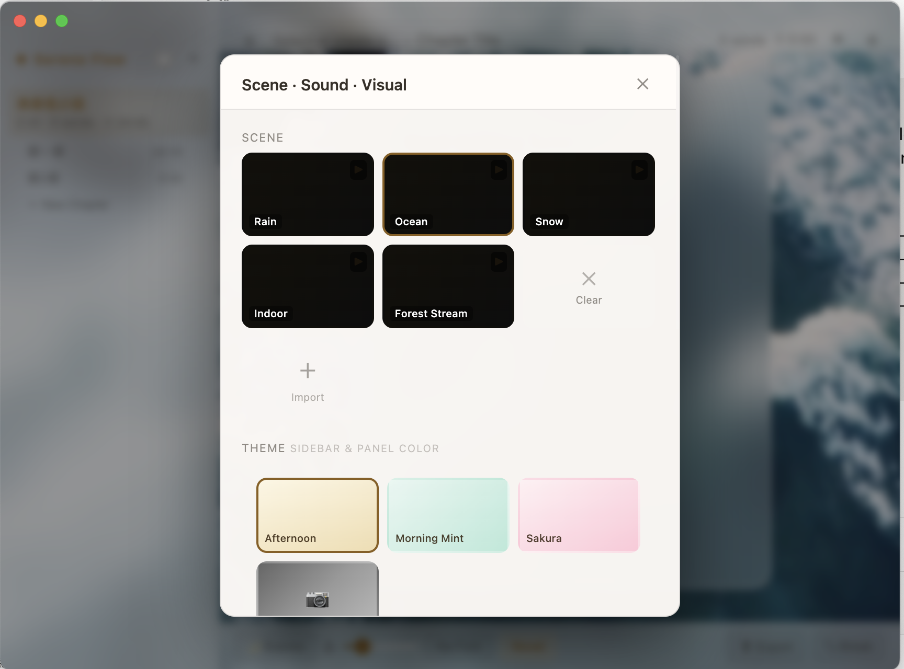
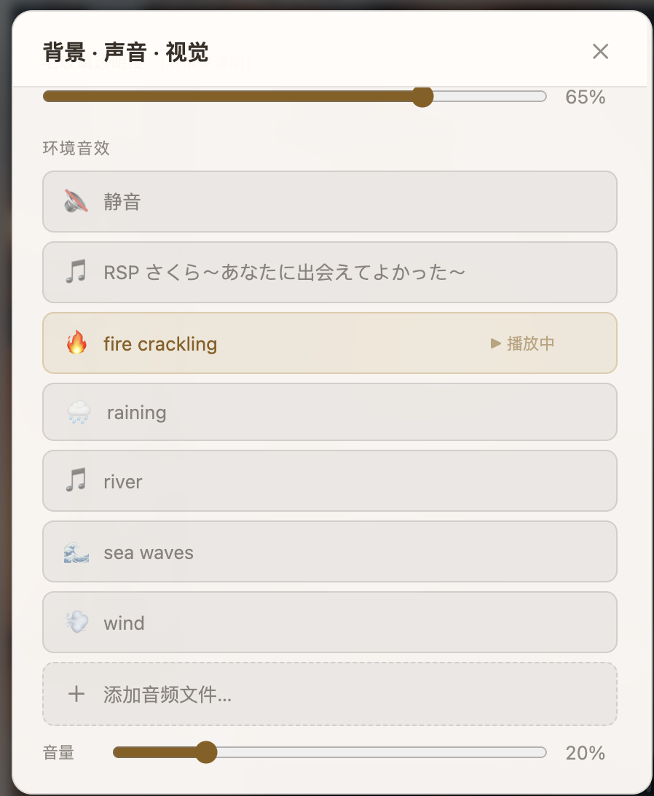
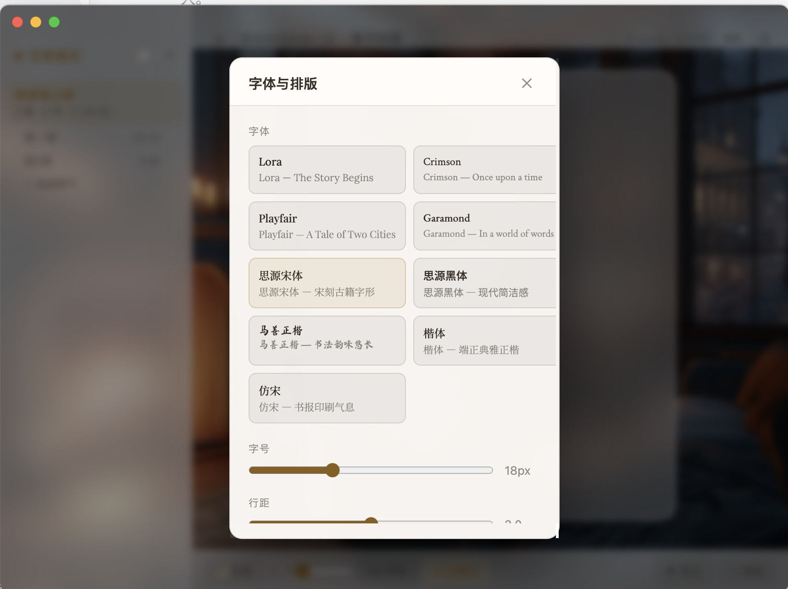
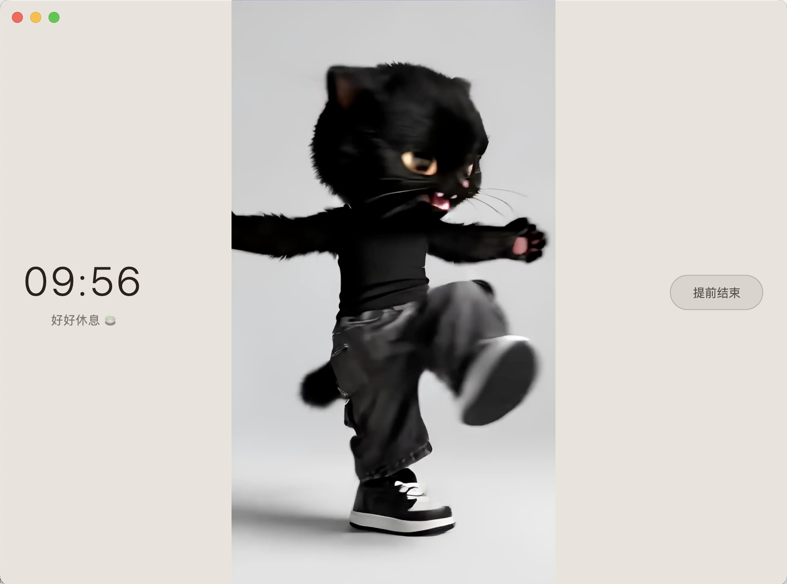
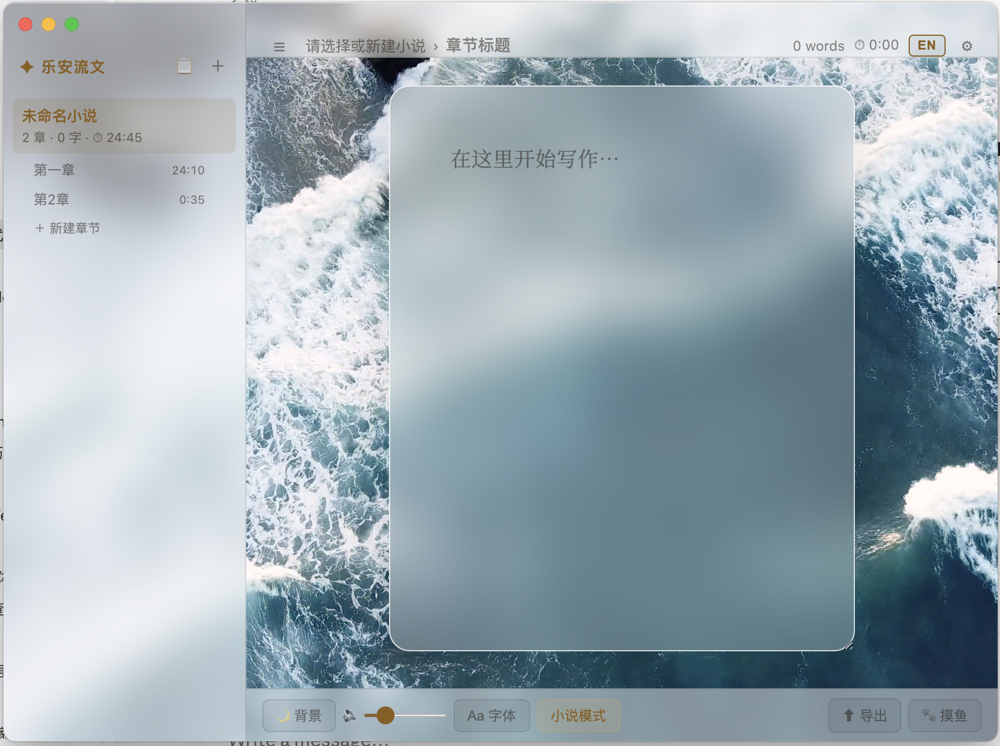

<div align="center">

# 乐安流文
## Serene Flow

专注写作的桌面应用，让创作回归文字本身。

A focused desktop writing app that brings creativity back to the words themselves.

[下载 / Download](#安装--installation) · [功能 / Features](#功能特性--features) · [使用说明 / Usage](#使用说明--usage)

</div>

---

## 场景视频下载 · Scene Video Downloads

> 三个大场景视频（大雪、大海、森林小溪）因超过 GitHub 100MB 限制，不包含在代码仓库中，需单独下载。
>
> Three large scene videos (Snow, Ocean, Forest Stream) exceed GitHub's 100MB limit and must be downloaded separately.

**第一步 / Step 1** — 前往 [Releases 页面](../../releases) 下载视频文件

Go to the [Releases page](../../releases) and download the `.mp4` files

**第二步 / Step 2** — 将文件放入以下路径的 `scene/` 文件夹

Place the files in the `scene/` folder at this path:

```
~/Library/Application Support/乐安流文/scene/
```

> 💡 路径不存在时，先启动一次 App 会自动创建。
>
> 💡 If the path doesn't exist, launch the app once — it will be created automatically.

---

## 截图 · Screenshots

### 沉浸式写作环境 · Immersive Writing Environment
> 场景背景 + 环境音效 + 毛玻璃编辑面板，专注于文字本身。
>
> Scene backgrounds, ambient sound, and a frosted-glass writing panel — built for deep focus.



### 场景与音效面板 · Scene & Sound Panel
> 一键切换场景，自动匹配环境音效（大海→海浪，大雪→壁炉声）。
>
> Switch scenes in one click — ambient sound auto-matches (ocean → waves, snow → fireplace).



### 毛玻璃编辑面板特写 · Frosted-glass Panel Close-up
> 可拖拽调节大小，支持自定义透明度和字体颜色。
>
> Freely resizable, with adjustable opacity and custom text color.


### 字体与排版 · Typography Settings
> 多款中英文字体，可调字号、行距、面板宽度和正文颜色。
>
> Multiple Chinese & English fonts, adjustable size, line height, panel width, and text color.



### 摸鱼 / 休息模式 · Break Mode
> 计时休息，播放自定义视频，右侧可提前结束。
>
> Timed break with custom video playback. End early anytime.



### 中英文界面切换 · Bilingual UI
> 右上角切换按钮，支持中文 ↔ English 随时切换。
>
> Toggle between Chinese and English at any time via the top-right button.



> 📸 如需更新截图，将图片放入 `screenshots/` 文件夹并替换对应文件名即可。
>
> 📸 To update screenshots, place images in the `screenshots/` folder with the matching filenames.

---

## 功能特性 · Features

| 功能 | Feature |
|------|---------|
| 📚 多小说 + 章节管理 | Multi-novel & chapter management |
| 🎨 场景背景（图片 / 视频） | Scene backgrounds (image / video) |
| 🔊 环境音效，自动匹配场景 | Ambient sound, auto-matched to scene |
| 🌗 多款色调主题 + 自定义背景 | Multiple themes + custom background |
| 🖋 多款中英文字体 | Multiple Chinese & English fonts |
| 📐 可拖拽调节的毛玻璃面板 | Draggable frosted-glass writing panel |
| 📊 字数 + 写作时长统计 | Word count & session time tracking |
| 📝 内置大纲编辑器 | Built-in outline editor |
| 📤 导出 TXT / Markdown / HTML | Export to TXT / Markdown / HTML |
| 🐾 摸鱼 / 休息模式 | Break mode with video |
| 🌐 中英双语界面可切换 | Bilingual UI (Chinese ↔ English) |

---

## 安装 · Installation

### 下载预编译版本
### Download prebuilt

前往 [Releases](../../releases) 下载 DMG：

Go to [Releases](../../releases) for the DMG installer:

| 文件 / File | 适用 / For |
|------------|-----------|
| `乐安流文-x.x.x-arm64.dmg` | Apple Silicon (M1 / M2 / M3) · 中文默认 |
| `乐安流文-x.x.x.dmg` | Intel Mac · 中文默认 |
| `Serene Flow-x.x.x-arm64.dmg` | Apple Silicon · English default |
| `Serene Flow-x.x.x.dmg` | Intel Mac · English default |

下载后拖入 Applications 文件夹。

Drag to Applications after download.

### 本地开发
### Local Development

**前提 / Prerequisites:** Node.js 18+

```bash
git clone https://github.com/wandixu/Serene-Flow-le-an-liu-wen.git
cd Serene-Flow-le-an-liu-wen
npm install
npm start
```

### 打包构建
### Build

```bash
npm run build      # 乐安流文（中文默认）
npm run build:en   # Serene Flow（English default）
```

---

## 使用说明 · Usage

### 写作流程 · Writing Workflow

1. **新建小说** — 点击侧边栏 `＋` 按钮，填写书名和首章标题

   **New novel** — Click `＋` in the sidebar, enter title and first chapter name

2. **切换章节** — 侧边栏点击章节；`＋ 新建章节` 添加新章节

   **Switch chapters** — Click in sidebar; `＋ New Chapter` to add more

3. **写作模式** — 底部栏切换随笔 / 小说模式

   **Writing mode** — Toggle Essay / Novel mode in the bottom bar

   - 随笔模式 Essay: 左对齐，无缩进 · Left-aligned, no indent
   - 小说模式 Novel: 首行缩进，两端对齐 · First-line indent, justified

### 场景与音效 · Scene & Sound

点击底部 `🌙 背景` 打开面板。选择场景时**自动匹配**对应音效：

Click `🌙 Scenes` in the bottom bar. Scene selection **auto-matches** ambient sound:

| 场景 / Scene | 音效 / Sound |
|-------------|-------------|
| 大海 / Ocean | 海浪 / Waves |
| 森林 · 小溪 / Forest · Stream | 流水 / Stream |
| 大雪 / Snow | 壁炉 / Fireplace |
| 屋内 / Indoor | 壁炉 / Fireplace |
| 下雨 / Rain | 雨声 / Rain |

### 媒体文件 · Media Files

媒体文件保存在用户数据目录，App 更新后不会丢失：

Media files are stored in the user data directory and survive app updates:

| 平台 / Platform | 路径 / Path |
|----------------|------------|
| macOS | `~/Library/Application Support/乐安流文/` |

子目录 / Subdirectories: `scene/` · `sound/` · `摸鱼/`

> 📦 大文件场景（大雪、大海、森林小溪）超过 GitHub 100MB 限制，请从 [Releases](../../releases) 页面下载后放入上述路径。
>
> 📦 Large scene videos (Snow, Ocean, Forest Stream) exceed GitHub's 100MB limit. Download them from the [Releases](../../releases) page and place them in the path above.

---

## 键盘快捷键 · Shortcuts

| 快捷键 / Shortcut | 功能 / Action |
|-------------------|---------------|
| `⌘ S` | 保存 / Save |
| `⌘ E` | 导出 / Export |
| `Esc` | 关闭面板 / Close panel |

---

## 技术栈 · Tech Stack

- **[Electron](https://www.electronjs.org/)** — 跨平台桌面框架 / Cross-platform desktop
- **[electron-store](https://github.com/sindresorhus/electron-store)** — 持久化存储 / Persistent storage
- **[Google Fonts](https://fonts.google.com/)** — Lora, Crimson, Playfair, Garamond, 思源宋体…
- 纯 HTML + CSS + JS，零前端框架 / Plain HTML + CSS + JS, no framework

---

## 开源许可 · License

[MIT License](LICENSE)

---

<div align="center">

*乐安流文 — 安心写作，万字不难。*

*Serene Flow — Write with peace of mind, ten thousand words at a time.*

</div>
